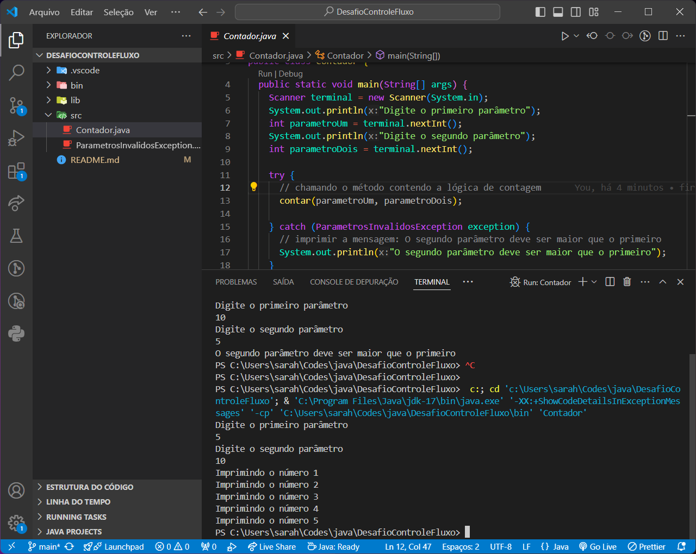

# Desafio Controle de Fluxo

- O sistema deverá receber dois parâmetros via terminal que representarão dois números inteiros; 
- Com estes dois números será obtida a quantidade de interações (`for`) e realizada a impressão no console (`System.out.print`) dos números incrementados;
- Se o primeiro parâmetro for MAIOR que o segundo parâmetro, será lançada uma exceção customizada chamada de `ParametrosInvalidosException` com a mensagem: "O segundo parâmetro deve ser maior que o primeiro".

